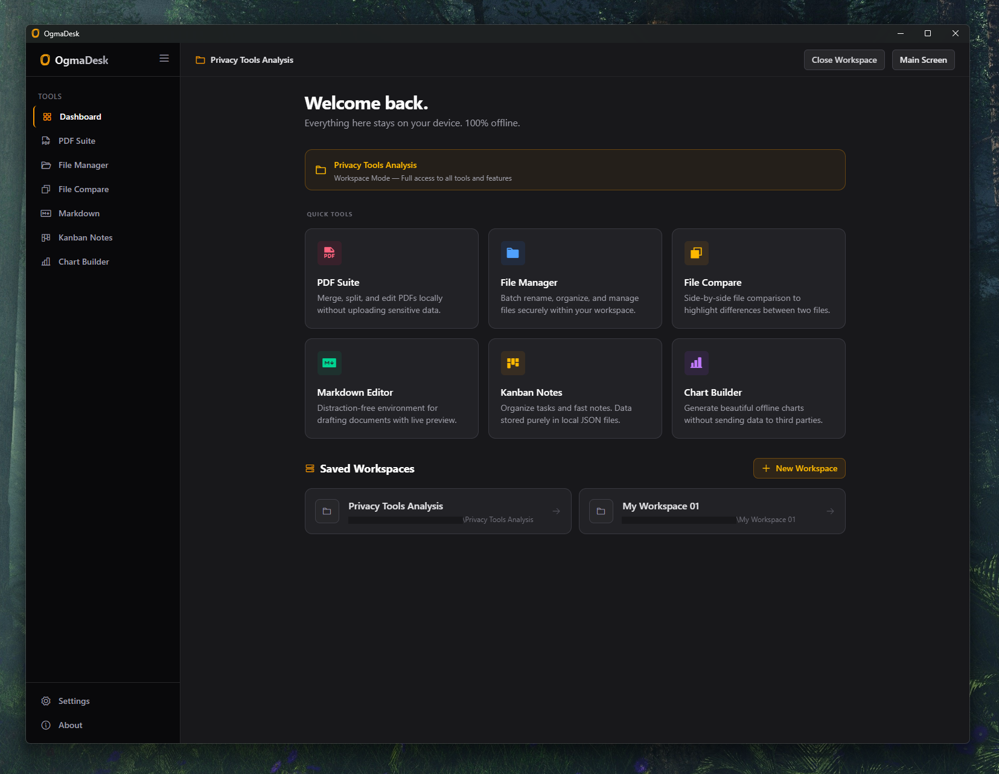

# OgmaDesk

OgmaDesk is a privacy-first desktop productivity suite that runs entirely on your local machine. No accounts, no cloud syncing, no telemetry - just powerful tools that keep your data on your device.



## Features

### Workspace Tools

- **PDF Suite** - Merge multiple PDFs, split PDFs, and perform basic PDF edits
- **File Manager** - Organize and manage files with a visual folder-tree structure
- **File Compare** - Compare two files side-by-side to find differences
- **Markdown Editor** - Write and preview Markdown with live editing
- **Kanban Notes** - Create and manage multiple boards with cards
- **Chart Builder** - Create interactive charts from your data

### Quick Mode Tools

The app also includes basic tools that can be used without a Workspace, allowing for quick tasks without setup.

## Flexible Workspace System

OgmaDesk features a flexible Workspace system that allows you to:

- Create workspaces for different projects or use-cases
- Work with tools that share data and work together within a workspace
- Use tools in Quick Mode for simple, standalone tasks

This gives you the flexibility to either work deeply within a Workspace or quickly access individual tools when needed.

## Tech Stack

- **Tauri v2** - A lightweight framework for building secure desktop apps with a Rust backend
- **Vanilla JavaScript** - Zero-build frontend for maximum performance
- **Tailwind CSS** - Utility-first CSS framework

## Privacy

OgmaDesk is designed to never send your data to any external server. All configuration, tool states, and workspace files remain strictly on your local disk. No telemetry, no analytics, no cloud syncing unless you explicitly use a third-party tool like Syncthing or Dropbox on your local folders.

## Installation

Download the latest release from the [Releases](https://github.com/nico-m-dev/ogmadesk/releases) page.

Supported platforms:
- Windows (x64)

## Development

```bash
# Install dependencies
npm install

# Run in development mode
npm run dev

# Build for production
npm run build
```

## License

[MIT](LICENSE)

## Author

Nico M